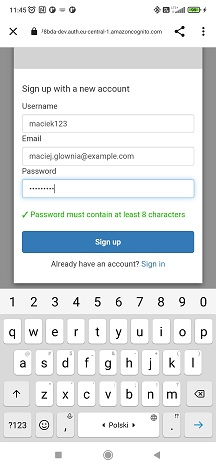
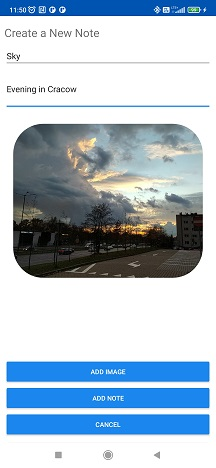
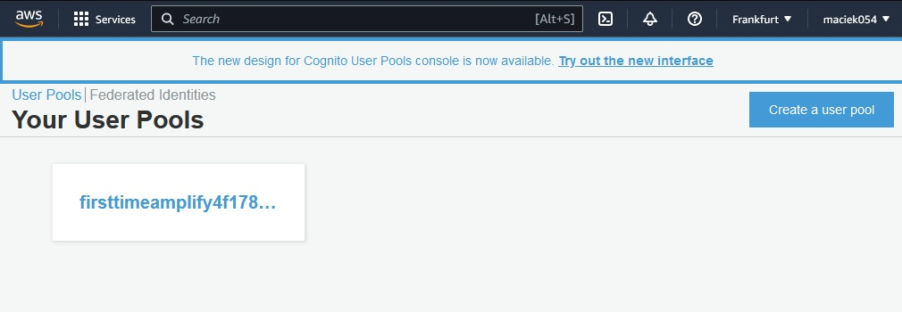
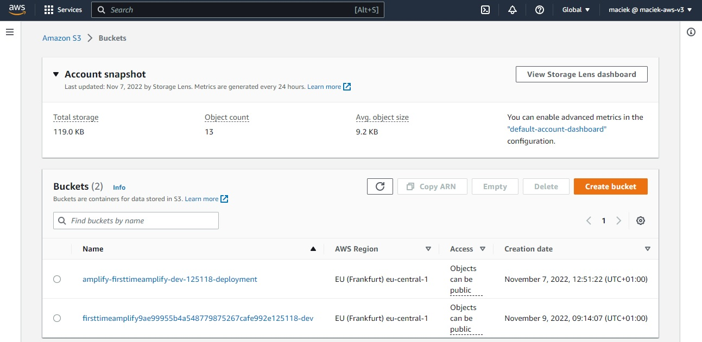
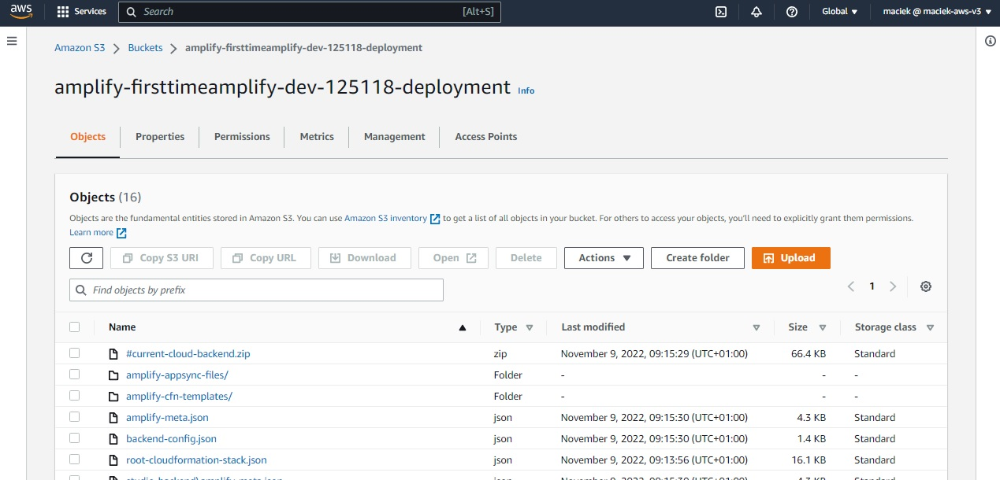

# First-Time-Amplify
---

### Goal

1. Get a knowledge how to create an Android application using AWS Amplify.
2. How to connect services in AWS together,
3. Improve understanding AWS Tools and Services: Management console, IAM, Cognito, S3, AWS Budgets.

### Screenshots of application

### Screenshots of AWS Services

### Overview

This is a demo application which has been done based on documentation available
here: 

The app includes:
1. Authentication to the app allowing users to sign up, sign in, and manage their account,
2. A scalable GraphQL API configured with an Amazon DynamoDB database allowing users to create and
   delete notes,
3. A file storage using Amazon S3 allowing users to upload images and view them in their app.

It's possible to to reuse or to delete the backend we just created: 

